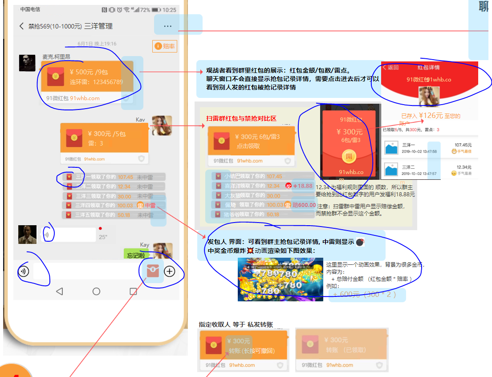

### icon等资源 `必要`（以下均指页面中的图片资源，，不用设计对应的页面）
1. 消息模块
    * 聊天页面 包括 红包样式，开红包页面，红包查看页面， 的 图片资源
    
    * 消息页面的四个icon (消息，通讯录，发现，我) 每个图标分别有 平常态 与 激活态
2. 

### 页面排版 `必要` (页面的排版)
1. 发现页
    * 需要 原型以及UI设计一下
    
